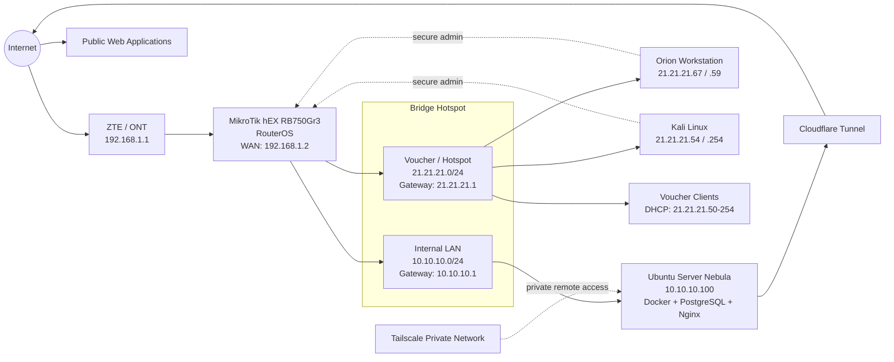
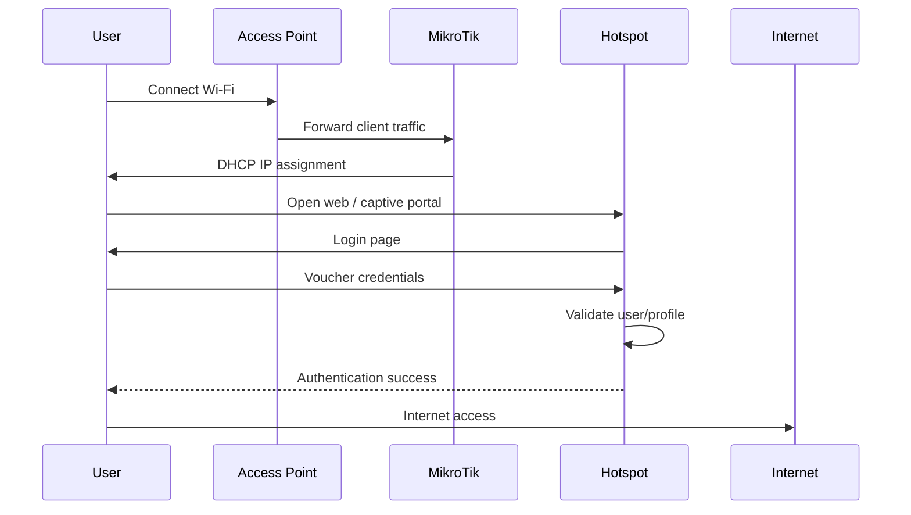
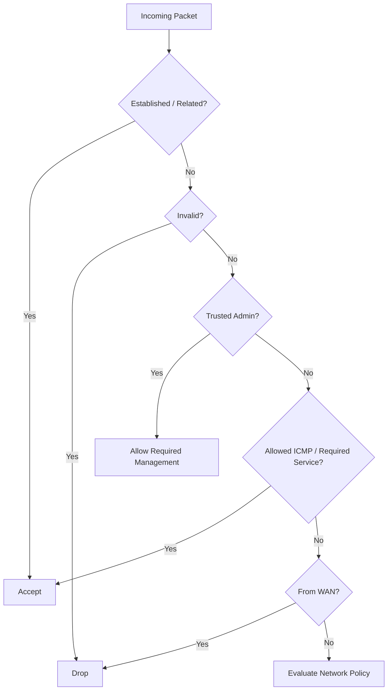
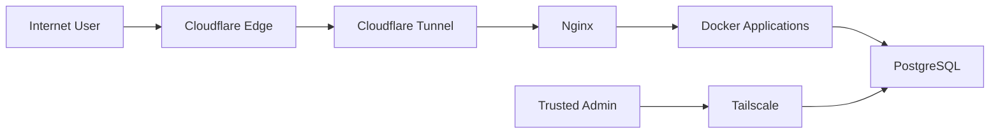
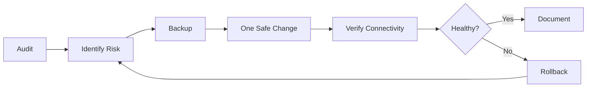

# MikroTik RouterOS & Integrated Network Infrastructure

> **Khairul Abdi Dongoran**
> Full-Stack Developer · Backend Engineer · Golang Developer · Linux Server & Network Infrastructure
>
> I design, configure, secure, audit, and maintain network infrastructure
> based on **MikroTik RouterOS**, integrated with Linux Server, Docker,
> Tailscale, Cloudflare Tunnel, Hotspot/Voucher, firewall, NAT, routing,
> monitoring, and production services.


This article explains how I build and maintain a MikroTik-based network
that works with Linux servers, Docker applications, private access, and
public web services. The goal is simple: keep the network stable, keep
access controlled, and make production changes with lower risk.

## About This Competency

My MikroTik experience is not limited to basic router configuration. I use
MikroTik as part of a real architecture that connects:

-   ISP / ONT connectivity;
-   internal networks;
-   Hotspot/Voucher networks;
-   Ubuntu Server for production applications;
-   Docker and PostgreSQL;
-   remote administration through Tailscale;
-   application publication through Cloudflare Tunnel;
-   firewall and network isolation;
-   monitoring, logging, backup, and troubleshooting.

My main focus is **availability, security, maintainability, and
troubleshooting without disrupting production**.

## Current Network Architecture



### Design principles

The network has two main address ranges inside the MikroTik
infrastructure:

| Network | Gateway | Purpose |
| --- | --- | --- |
| `192.168.1.0/24` | `192.168.1.1` | WAN between ONT/ZTE and MikroTik |
| `10.10.10.0/24` | `10.10.10.1` | Internal LAN / server |
| `21.21.21.0/24` | `21.21.21.1` | Hotspot, voucher, and selected workstations |

The MikroTik WAN receives `192.168.1.2/24` and uses `192.168.1.1` as the
upstream gateway.

The **Nebula** server is on `10.10.10.100`, while the voucher network uses
`21.21.21.0/24`.

> The addresses above are private/internal network addresses used to
> explain the design. Credentials, private keys, secrets, and tokens are
> not published.

## Network Segmentation & Isolation

One important control is preventing voucher clients from accessing the
server/internal network.

``` text
Voucher / Guest
21.21.21.0/24
       |
       | Internet access: ALLOWED
       |
       +---------------------------> Internet
       |
       X  Internal access: BLOCKED
       |
10.10.10.0/24
Internal / Server
```

The firewall applies this concept:

``` text
src-address = 21.21.21.0/24
dst-address = 10.10.10.0/24
action      = drop
```

This allows Hotspot users to keep using the Internet without freely
accessing the internal server network.

## Hotspot & Voucher Architecture

MikroTik runs Hotspot on this network:

``` text
Network : 21.21.21.0/24
Gateway : 21.21.21.1
DHCP    : 21.21.21.50 - 21.21.21.254
```

The flow:



### Voucher management

I understand and manage these concepts:

-   Hotspot user;
-   user profile;
-   session;
-   active user;
-   cookie / MAC cookie;
-   HTTP CHAP/PAP;
-   time-based voucher;
-   scheduler;
-   bandwidth/profile control;
-   Mikhmon integration;
-   custom captive portal;
-   expiry automation;
-   user/session cleanup;
-   logging and troubleshooting.

Example profiles used in the implementation include duration-based
packages such as:

``` text
Paket-5Jam
Paket-2Hari/24Jam
Paket-4Hari/24Jam
Paket-7Hari/24Jam
Paket-30H/24Jam
```

## Secure Administration

Router management is not opened freely to every client.

Administrative access is focused on trusted devices such as the **Orion**
workstation and **Kali Linux**.

### SSH

Security configuration applied:

-   password authentication is disabled;
-   authentication uses an **ED25519 SSH public key**;
-   SSH forwarding is disabled;
-   strong crypto is enabled;
-   SSH access is limited to trusted management IPs.

### WinBox

WinBox remains available for GUI administration, but the connection source
is limited to authorized management addresses.

### Layer-2 management

To reduce the attack surface:

-   MAC Server is limited/disabled;
-   MAC WinBox is limited/disabled;
-   MAC Ping is disabled;
-   Neighbor Discovery is not exposed freely;
-   RoMON is disabled when it is not required.

## Firewall Strategy

I audit and harden the **input chain**, **forward chain**, NAT, connection
tracking, and service exposure.

Main concept:



Areas I audit:

-   `input` vs `forward`;
-   established/related connections;
-   invalid connections;
-   ICMP;
-   DHCP;
-   WAN exposure;
-   source address lists;
-   network isolation;
-   NAT masquerade;
-   stale/legacy firewall rules;
-   connection tracking;
-   service ports/helpers;
-   SYN state and abnormal connections.

## NAT & Internet Access

MikroTik performs source NAT/masquerade so internal and Hotspot networks
can access the Internet.

Concept:

``` text
Client 21.21.21.x
       |
       v
MikroTik
srcnat / masquerade
       |
       v
WAN 192.168.1.2
       |
       v
ONT 192.168.1.1
       |
       v
Internet
```

I also audit legacy `dstnat`/port-forwarding rules and remove old rules
that are no longer used after validation, so production services are not
interrupted.

## Linux Server Integration

MikroTik does not stand alone. The infrastructure is integrated with
**Ubuntu Server Nebula**.



Nebula uses:

``` text
LAN IP     : 10.10.10.100
OS         : Ubuntu Server 24.04
Containers : Docker / Docker Compose
Proxy      : Nginx
Database   : PostgreSQL
Remote     : Tailscale
Public Web : Cloudflare Tunnel
Firewall   : UFW
```

Public websites do not require direct inbound port forwarding from the
Internet to the server because public access can use an **outbound
Cloudflare Tunnel**.

This reduces exposure for the home/server network.

## Tailscale & Private Remote Access

Remote administration uses a private overlay network.

Use cases:

-   SSH server;
-   remote database access;
-   server administration;
-   private service exposure;
-   troubleshooting;
-   management from another workstation.

PostgreSQL can remain bound to localhost/internal interfaces and be
forwarded in a limited way through Tailscale for trusted devices.

## Traffic Management

I also understand MikroTik usage for:

-   Simple Queue;
-   Queue Tree;
-   packet/connection marking;
-   Mangle;
-   traffic classification;
-   per-user/profile bandwidth;
-   HTTP/HTTPS traffic classification;
-   ICMP handling;
-   traffic monitoring;
-   connection inspection.

In a production environment, changes to queue/mangle are made
conservatively because they can directly affect connection quality for
all users.

## DHCP, ARP & Address Management

Areas I manage/audit:

``` text
IPv4
Subnet / CIDR
ARP
DHCP Server
DHCP Lease
Static Lease
IP Pool
Gateway
DNS
Routing Table
Connection Tracking
```

I use static DHCP leases for important devices so their addresses remain
consistent and easier to monitor.

## Routing

The current main routing is simple and maintainable:

``` text
0.0.0.0/0
   |
   +--> 192.168.1.1 (upstream gateway)

10.10.10.0/24
   +--> directly connected

21.21.21.0/24
   +--> directly connected

192.168.1.0/24
   +--> directly connected WAN
```

I also audit:

-   old static routes;
-   routing table;
-   routing rules;
-   gateway;
-   source routing;
-   ICMP redirects;
-   route consistency.

## Logging & Storage

I understand the impact of logging on MikroTik devices with limited
internal flash.

Audit areas include:

-   memory logging;
-   disk logging;
-   Hotspot debug logging;
-   log rotation;
-   RouterOS internal storage;
-   export configuration;
-   binary backup;
-   external USB storage;
-   remote syslog.

A long-term strategy can use USB or remote logging to reduce repeated
writes to internal flash.

## Backup & Recovery

Before significant changes, I create backups first.

Example:

``` text
MikroTik
   |
   +-- Binary Backup
   |
   +-- RouterOS Export (.rsc)
   |
   +-- Hotspot Portal Files
   |
   +--> Secure copy to Linux workstation/server
```

Backups can be stored on:

-   workstation;
-   server;
-   USB storage;
-   secure documentation repository.

Secrets/private keys are not stored in public repositories.

## Production Change Strategy

I avoid the approach of *"change many configurations and see whether
something breaks"*.

My workflow:



Validation after changes can include:

-   ping gateway;
-   ping Internet;
-   DNS resolution;
-   voucher login;
-   Hotspot session;
-   server connectivity;
-   SSH/WinBox access;
-   public website availability;
-   Docker/application health.

## Troubleshooting Approach

I use a layer-by-layer approach:

``` text
Physical Link
    ↓
Ethernet / Bridge
    ↓
ARP
    ↓
IPv4 / Subnet
    ↓
Routing
    ↓
NAT
    ↓
Firewall
    ↓
TCP / UDP
    ↓
DNS
    ↓
Application
```

Tools commonly used:

``` text
MikroTik Terminal
WinBox
ping
traceroute
Torch
Packet Sniffer
Connection Tracking
ARP Table
Routing Table
Firewall Counters
Linux ip / ss / ping / traceroute
tcpdump / Wireshark
nmap (authorized environments)
Tailscale diagnostics
Docker / systemd logs
```

## Core MikroTik & Networking Skills

**MikroTik RouterOS**

-   RouterOS configuration & troubleshooting
-   MikroTik hEX / RB750Gr3
-   Bridge configuration
-   IPv4 addressing
-   Subnetting & CIDR
-   ARP
-   DHCP Server & DHCP Lease
-   IP Pool
-   DNS
-   Static & default routing
-   NAT / Masquerade
-   Firewall Input / Forward
-   Address List
-   Connection Tracking
-   Mangle
-   Queue / Traffic Control
-   Hotspot
-   Voucher Management
-   Mikhmon integration
-   Scheduler & RouterOS scripts
-   SSH / WinBox hardening
-   Logging
-   Backup & restore
-   USB/external storage planning

**Networking & Security**

-   TCP/IP
-   TCP vs UDP
-   ICMP
-   Ports & services
-   Network segmentation
-   Firewall / ACL
-   Least-privilege administration
-   SSH public-key authentication
-   ED25519
-   Layer-2 management hardening
-   Secure remote access
-   Tailscale / WireGuard concepts
-   Cloudflare Tunnel
-   UFW
-   Linux networking
-   Network reconnaissance and troubleshooting in authorized environments

## What I Can Help Build

I am open to project collaboration and work opportunities that need a
combination of **Software Engineering + Server + Networking**.

I can help with:

-   MikroTik setup for homes, offices, businesses, or hotspots;
-   internal network and guest network design;
-   MikroTik Hotspot/Voucher;
-   firewall hardening;
-   network segmentation;
-   DHCP/DNS/NAT/routing;
-   bandwidth management;
-   secure remote administration;
-   Linux server integration;
-   Docker infrastructure;
-   Cloudflare Tunnel;
-   Tailscale/private networking;
-   server and network troubleshooting;
-   network audit;
-   backup & recovery planning;
-   topology and SOP documentation.

## Project Collaboration Workflow

``` text
1. REQUIREMENT
   Understand business needs, user count, ISP, server, applications, and security.

2. NETWORK DESIGN
   Create topology, IP plan, segmentation, access policy, and capacity plan.

3. SECURITY DESIGN
   Define firewall, management access, isolation, VPN, logging, and backup.

4. IMPLEMENTATION
   Configure MikroTik, Linux Server, access points, VPN, and related services.

5. TESTING
   Connectivity, DNS, routing, firewall, voucher, bandwidth, fail/recovery test.

6. DOCUMENTATION
   Diagrams, IP plan, configuration notes, SOP, backup, and recovery procedure.

7. MAINTENANCE
   Monitoring, troubleshooting, updates, backup, and capacity review.
```

## Why This Combination Matters

As a **Backend / Full-Stack Engineer**, I do not only see applications
from the source-code side.

I can trace a request through:

``` text
Client
 ↓
Wi-Fi / Ethernet
 ↓
MikroTik
 ↓
Routing / NAT / Firewall
 ↓
Linux Server
 ↓
Nginx / Cloudflare Tunnel
 ↓
Docker
 ↓
Backend API
 ↓
PostgreSQL
```

This helps during troubleshooting because production problems do not
always come from application code. The issue can be in DNS, routing,
firewall, NAT, Linux, containers, reverse proxy, database, or the
application itself.

## Security Philosophy

> **Expose only what is required. Trust only what is explicitly authorized. Keep recovery possible before changing production.**

Principles I use:

-   least privilege;
-   deny unnecessary inbound access;
-   isolate untrusted clients;
-   prefer key-based authentication;
-   minimize exposed management services;
-   separate public and private access paths;
-   backup before major changes;
-   monitor before optimizing;
-   make incremental production changes;
-   document infrastructure.

## Contact

**Khairul Abdi Dongoran**

Full-Stack Developer · Backend Engineer · Golang Developer · Linux Server · MikroTik RouterOS · Network Infrastructure

-   GitHub: `github.com/khairul-abdi`
-   LinkedIn: `linkedin.com/in/khairul-abdi-dongoran`
-   Website: `khairul-abdi-dongoran.com`

> Open for software engineering roles, backend/full-stack opportunities,
> infrastructure collaboration, MikroTik/network projects, and technical
> consulting.
