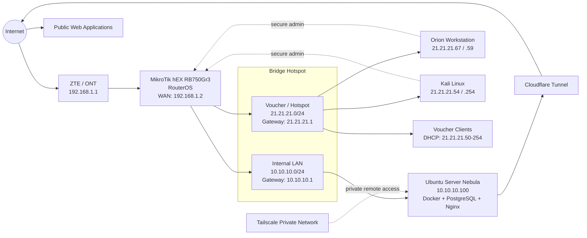
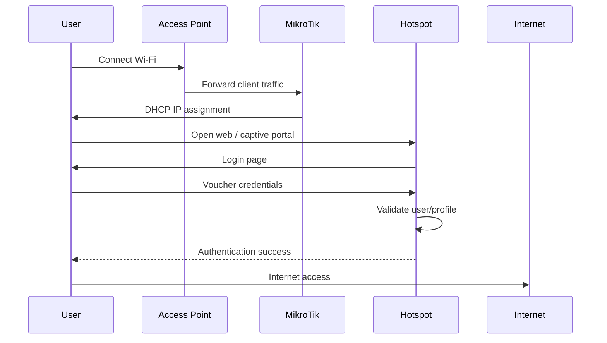
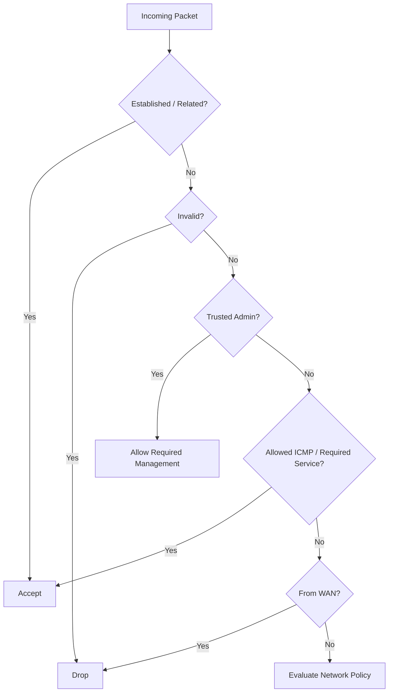
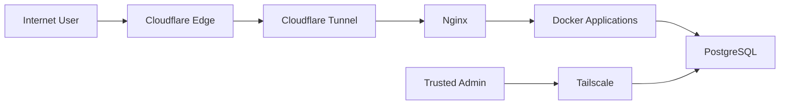
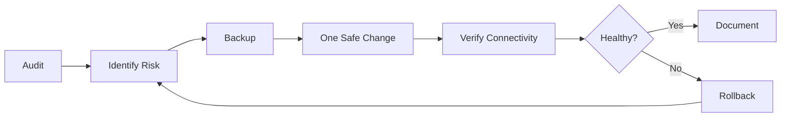

# MikroTik RouterOS & Infrastruktur Jaringan Terintegrasi

> **Khairul Abdi Dongoran**
> Full-Stack Developer · Backend Engineer · Golang Developer · Linux Server & Network Infrastructure
>
> Saya merancang, mengonfigurasi, mengamankan, mengaudit, dan memelihara
> infrastruktur jaringan berbasis **MikroTik RouterOS** yang
> terintegrasi dengan Linux Server, Docker, Tailscale, Cloudflare
> Tunnel, Hotspot/Voucher, firewall, NAT, routing, monitoring, dan
> layanan production.


Artikel ini merangkum cara saya membangun dan merawat jaringan MikroTik
yang terhubung dengan server Linux, aplikasi Docker, akses privat, dan
layanan publik. Fokusnya sederhana: jaringan tetap stabil, akses tetap
terkontrol, dan perubahan production bisa dilakukan dengan risiko yang
lebih rendah.

## Tentang Kompetensi Ini

Pengalaman MikroTik saya tidak hanya sebatas konfigurasi router dasar.
Saya menggunakan MikroTik sebagai bagian dari arsitektur nyata yang
menghubungkan:

-   koneksi ISP / ONT;
-   jaringan internal;
-   jaringan Hotspot/Voucher;
-   Ubuntu Server untuk aplikasi production;
-   Docker dan PostgreSQL;
-   remote administration melalui Tailscale;
-   publikasi aplikasi melalui Cloudflare Tunnel;
-   firewall dan network isolation;
-   monitoring, logging, backup, dan troubleshooting.

Fokus utama saya adalah **availability, security, maintainability, dan
troubleshooting tanpa mengganggu production**.

## Arsitektur Jaringan Saat Ini



### Prinsip desain

Jaringan memiliki dua address range utama pada infrastruktur MikroTik:

| Network | Gateway | Fungsi |
| --- | --- | --- |
| `192.168.1.0/24` | `192.168.1.1` | WAN antara ONT/ZTE dan MikroTik |
| `10.10.10.0/24` | `10.10.10.1` | Internal LAN / server |
| `21.21.21.0/24` | `21.21.21.1` | Hotspot, voucher, dan workstation tertentu |

WAN MikroTik memperoleh alamat `192.168.1.2/24` dan menggunakan
`192.168.1.1` sebagai upstream gateway.

Server **Nebula** berada di `10.10.10.100`, sedangkan jaringan voucher
menggunakan `21.21.21.0/24`.

> Alamat di atas adalah private/internal network addressing untuk
> menjelaskan desain. Kredensial, private key, secret, dan token tidak
> dipublikasikan.

## Segmentasi dan Isolasi Jaringan

Salah satu kontrol penting adalah mencegah client voucher mengakses
jaringan server/internal.

``` text
Voucher / Guest
21.21.21.0/24
       |
       | Internet access: ALLOWED
       |
       +---------------------------> Internet
       |
       X  Internal access: BLOCKED
       |
10.10.10.0/24
Internal / Server
```

Firewall menerapkan konsep:

``` text
src-address = 21.21.21.0/24
dst-address = 10.10.10.0/24
action      = drop
```

Dengan demikian user Hotspot tetap dapat menggunakan Internet, tetapi
tidak bebas mengakses server internal.

## Arsitektur Hotspot dan Voucher

MikroTik menjalankan Hotspot pada jaringan:

``` text
Network : 21.21.21.0/24
Gateway : 21.21.21.1
DHCP    : 21.21.21.50 - 21.21.21.254
```

Alurnya:



### Manajemen voucher

Saya memahami dan mengelola konsep:

-   Hotspot user;
-   user profile;
-   session;
-   active user;
-   cookie / MAC cookie;
-   HTTP CHAP/PAP;
-   time-based voucher;
-   scheduler;
-   bandwidth/profile control;
-   Mikhmon integration;
-   custom captive portal;
-   expiry automation;
-   user/session cleanup;
-   logging dan troubleshooting.

Contoh profile yang digunakan pada implementasi mencakup paket berbasis
durasi seperti:

``` text
Paket-5Jam
Paket-2Hari/24Jam
Paket-4Hari/24Jam
Paket-7Hari/24Jam
Paket-30H/24Jam
```

## Administrasi Router yang Aman

Management router tidak dibuka bebas ke seluruh client.

Akses administrasi difokuskan pada perangkat yang dipercaya, misalnya
workstation **Orion** dan **Kali Linux**.

### SSH

Konfigurasi keamanan yang diterapkan:

-   password authentication dinonaktifkan;
-   autentikasi menggunakan **ED25519 SSH public key**;
-   SSH forwarding dinonaktifkan;
-   strong crypto diaktifkan;
-   akses SSH dibatasi ke trusted management IP.

### WinBox

WinBox tetap tersedia untuk administrasi GUI, tetapi sumber koneksi
dibatasi ke alamat management yang telah diotorisasi.

### Manajemen Layer-2

Untuk mengurangi attack surface:

-   MAC Server dibatasi/dinonaktifkan;
-   MAC WinBox dibatasi/dinonaktifkan;
-   MAC Ping dinonaktifkan;
-   Neighbor Discovery tidak diekspos secara bebas;
-   RoMON dinonaktifkan jika tidak diperlukan.

## Strategi Firewall

Saya melakukan audit dan hardening terhadap **input chain**, **forward
chain**, NAT, connection tracking, dan service exposure.

Konsep utama:



Hal yang saya audit:

-   `input` vs `forward`;
-   established/related connection;
-   invalid connection;
-   ICMP;
-   DHCP;
-   WAN exposure;
-   source address lists;
-   network isolation;
-   NAT masquerade;
-   stale/legacy firewall rules;
-   connection tracking;
-   service ports/helpers;
-   SYN state dan abnormal connections.

## NAT dan Akses Internet

MikroTik melakukan source NAT/masquerade agar jaringan internal dan
Hotspot dapat mengakses Internet.

Konsep:

``` text
Client 21.21.21.x
       |
       v
MikroTik
srcnat / masquerade
       |
       v
WAN 192.168.1.2
       |
       v
ONT 192.168.1.1
       |
       v
Internet
```

Saya juga melakukan audit terhadap legacy `dstnat`/port-forwarding dan
menghapus rule lama yang sudah tidak digunakan setelah melakukan
validasi agar tidak memutus layanan production.

## Integrasi dengan Linux Server

MikroTik tidak berdiri sendiri. Infrastruktur terintegrasi dengan
**Ubuntu Server Nebula**.



Nebula menggunakan:

``` text
LAN IP     : 10.10.10.100
OS         : Ubuntu Server 24.04
Containers : Docker / Docker Compose
Proxy      : Nginx
Database   : PostgreSQL
Remote     : Tailscale
Public Web : Cloudflare Tunnel
Firewall   : UFW
```

Public website tidak membutuhkan inbound port-forward langsung dari
Internet ke server karena koneksi publik dapat menggunakan **outbound
Cloudflare Tunnel**.

Ini mengurangi exposure jaringan rumah/server.

## Tailscale dan Akses Privat

Remote administration menggunakan private overlay network.

Use case:

-   SSH server;
-   remote database access;
-   server administration;
-   private service exposure;
-   troubleshooting;
-   management dari workstation lain.

PostgreSQL dapat tetap bound ke localhost/internal interface dan
diteruskan secara terbatas melalui Tailscale untuk trusted devices.

## Manajemen Lalu Lintas

Saya juga memahami penggunaan MikroTik untuk:

-   Simple Queue;
-   Queue Tree;
-   packet/connection marking;
-   Mangle;
-   traffic classification;
-   per-user/profile bandwidth;
-   HTTP/HTTPS traffic classification;
-   ICMP handling;
-   traffic monitoring;
-   connection inspection.

Pada environment production, perubahan terhadap queue/mangle dilakukan
secara konservatif karena dapat langsung memengaruhi kualitas koneksi
seluruh user.

## DHCP, ARP, dan Manajemen Alamat

Area yang saya kelola/audit:

``` text
IPv4
Subnet / CIDR
ARP
DHCP Server
DHCP Lease
Static Lease
IP Pool
Gateway
DNS
Routing Table
Connection Tracking
```

Saya menggunakan static DHCP lease untuk perangkat penting agar
alamatnya konsisten dan lebih mudah dimonitor.

## Routing

Routing utama saat ini sederhana dan mudah dipelihara:

``` text
0.0.0.0/0
   |
   +--> 192.168.1.1 (upstream gateway)

10.10.10.0/24
   +--> directly connected

21.21.21.0/24
   +--> directly connected

192.168.1.0/24
   +--> directly connected WAN
```

Saya juga melakukan audit terhadap:

-   static route lama;
-   routing table;
-   routing rule;
-   gateway;
-   source routing;
-   ICMP redirects;
-   route consistency.

## Logging dan Storage

Saya memahami dampak logging terhadap perangkat MikroTik dengan internal
flash terbatas.

Audit meliputi:

-   memory logging;
-   disk logging;
-   Hotspot debug logging;
-   log rotation;
-   RouterOS internal storage;
-   export configuration;
-   binary backup;
-   external USB storage;
-   remote syslog.

Strategi jangka panjang dapat menggunakan USB atau remote logging untuk
mengurangi penulisan berulang ke internal flash.

## Backup dan Recovery

Sebelum perubahan signifikan, saya menerapkan backup terlebih dahulu.

Contoh:

``` text
MikroTik
   |
   +-- Binary Backup
   |
   +-- RouterOS Export (.rsc)
   |
   +-- Hotspot Portal Files
   |
   +--> Secure copy to Linux workstation/server
```

Backup dapat disimpan pada:

-   workstation;
-   server;
-   USB storage;
-   repository dokumentasi yang aman.

Secret/private key tidak disimpan pada repository publik.

## Strategi Perubahan di Produksi

Saya menghindari pendekatan *"ubah banyak konfigurasi lalu lihat apakah
rusak"*.

Workflow saya:



Validasi setelah perubahan dapat mencakup:

-   ping gateway;
-   ping Internet;
-   DNS resolution;
-   voucher login;
-   Hotspot session;
-   server connectivity;
-   SSH/WinBox access;
-   public website availability;
-   Docker/application health.

## Pendekatan Troubleshooting

Saya menggunakan pendekatan layer-by-layer:

``` text
Physical Link
    ↓
Ethernet / Bridge
    ↓
ARP
    ↓
IPv4 / Subnet
    ↓
Routing
    ↓
NAT
    ↓
Firewall
    ↓
TCP / UDP
    ↓
DNS
    ↓
Application
```

Tools yang biasa digunakan:

``` text
MikroTik Terminal
WinBox
ping
traceroute
Torch
Packet Sniffer
Connection Tracking
ARP Table
Routing Table
Firewall Counters
Linux ip / ss / ping / traceroute
tcpdump / Wireshark
nmap (authorized environments)
Tailscale diagnostics
Docker / systemd logs
```

## Skill Inti MikroTik dan Networking

**MikroTik RouterOS**

-   RouterOS configuration & troubleshooting
-   MikroTik hEX / RB750Gr3
-   Bridge configuration
-   IPv4 addressing
-   Subnetting & CIDR
-   ARP
-   DHCP Server & DHCP Lease
-   IP Pool
-   DNS
-   Static & default routing
-   NAT / Masquerade
-   Firewall Input / Forward
-   Address List
-   Connection Tracking
-   Mangle
-   Queue / Traffic Control
-   Hotspot
-   Voucher Management
-   Mikhmon integration
-   Scheduler & RouterOS scripts
-   SSH / WinBox hardening
-   Logging
-   Backup & restore
-   USB/external storage planning

**Networking & Security**

-   TCP/IP
-   TCP vs UDP
-   ICMP
-   Ports & services
-   Network segmentation
-   Firewall / ACL
-   Least-privilege administration
-   SSH public-key authentication
-   ED25519
-   Layer-2 management hardening
-   Secure remote access
-   Tailscale / WireGuard concepts
-   Cloudflare Tunnel
-   UFW
-   Linux networking
-   Network reconnaissance and troubleshooting in authorized environments

## Hal yang Bisa Saya Bantu Bangun

Saya terbuka untuk kerja sama project maupun kesempatan kerja yang
membutuhkan kombinasi **Software Engineering + Server + Networking**.

Saya dapat membantu dalam:

-   setup MikroTik untuk rumah, kantor, usaha, atau hotspot;
-   desain jaringan internal dan guest network;
-   Hotspot/Voucher MikroTik;
-   firewall hardening;
-   network segmentation;
-   DHCP/DNS/NAT/routing;
-   bandwidth management;
-   secure remote administration;
-   Linux server integration;
-   Docker infrastructure;
-   Cloudflare Tunnel;
-   Tailscale/private networking;
-   server and network troubleshooting;
-   network audit;
-   backup & recovery planning;
-   dokumentasi topology dan SOP.

## Alur Kolaborasi Proyek

``` text
1. REQUIREMENT
   Memahami kebutuhan bisnis, jumlah user, ISP, server, aplikasi, dan security.

2. NETWORK DESIGN
   Membuat topology, IP plan, segmentasi, access policy, dan capacity plan.

3. SECURITY DESIGN
   Menentukan firewall, management access, isolation, VPN, logging, dan backup.

4. IMPLEMENTATION
   Konfigurasi MikroTik, Linux Server, access point, VPN, dan layanan terkait.

5. TESTING
   Connectivity, DNS, routing, firewall, voucher, bandwidth, fail/recovery test.

6. DOCUMENTATION
   Diagram, IP plan, configuration notes, SOP, backup, dan recovery procedure.

7. MAINTENANCE
   Monitoring, troubleshooting, update, backup, dan capacity review.
```

## Kenapa Kombinasi Ini Penting

Sebagai **Backend / Full-Stack Engineer**, saya tidak hanya melihat
aplikasi dari sisi source code.

Saya dapat mengikuti request dari:

``` text
Client
 ↓
Wi-Fi / Ethernet
 ↓
MikroTik
 ↓
Routing / NAT / Firewall
 ↓
Linux Server
 ↓
Nginx / Cloudflare Tunnel
 ↓
Docker
 ↓
Backend API
 ↓
PostgreSQL
```

Hal ini membantu ketika melakukan troubleshooting karena masalah
production tidak selalu berasal dari application code. Masalah dapat
berada di DNS, routing, firewall, NAT, Linux, container, reverse proxy,
database, atau aplikasi itu sendiri.

## Prinsip Keamanan

> **Expose only what is required. Trust only what is explicitly authorized. Keep recovery possible before changing production.**

Prinsip yang saya gunakan:

-   least privilege;
-   deny unnecessary inbound access;
-   isolate untrusted clients;
-   prefer key-based authentication;
-   minimize exposed management services;
-   separate public and private access paths;
-   backup before major changes;
-   monitor before optimizing;
-   make incremental production changes;
-   document infrastructure.

## Kontak

**Khairul Abdi Dongoran**

Full-Stack Developer · Backend Engineer · Golang Developer · Linux Server · MikroTik RouterOS · Network Infrastructure

-   GitHub: `github.com/khairul-abdi`
-   LinkedIn: `linkedin.com/in/khairul-abdi-dongoran`
-   Website: `khairul-abdi-dongoran.com`

> Open for software engineering roles, backend/full-stack opportunities,
> infrastructure collaboration, MikroTik/network projects, and technical
> consulting.
